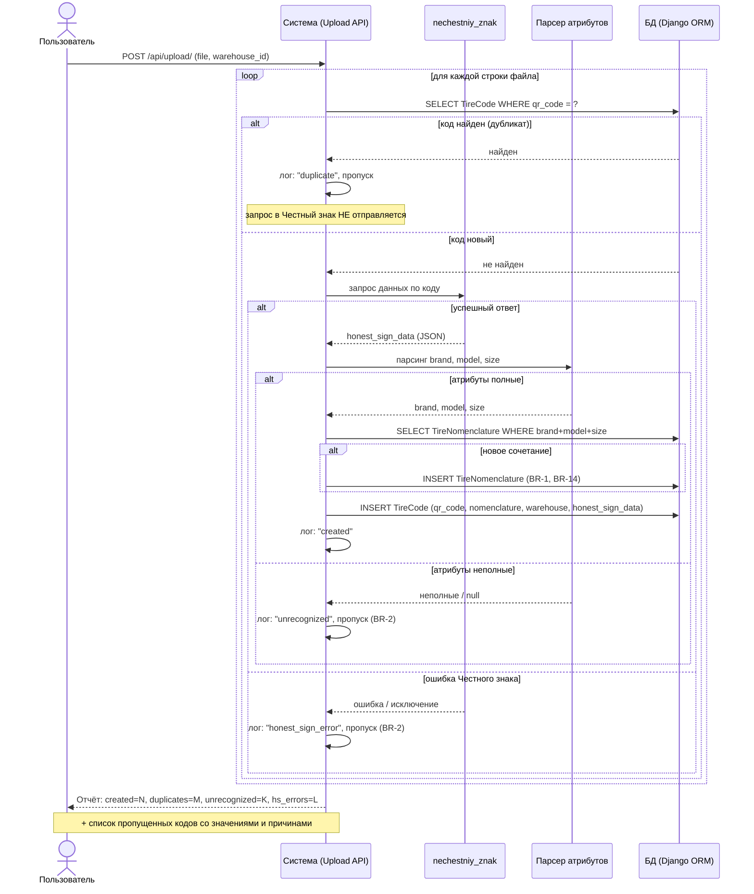
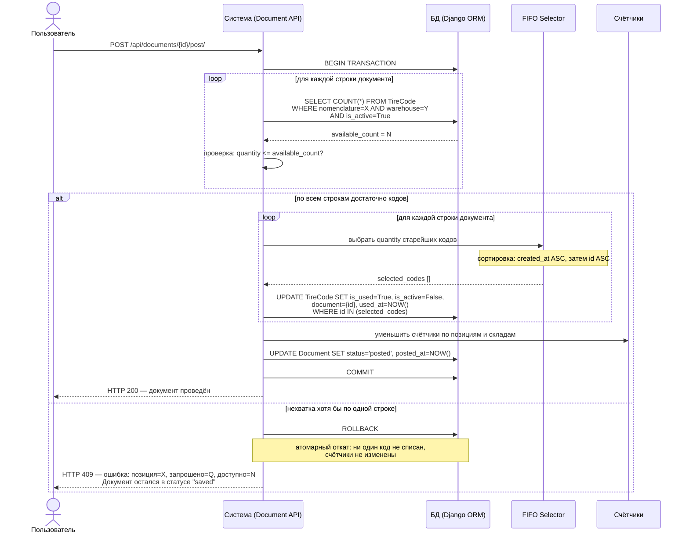
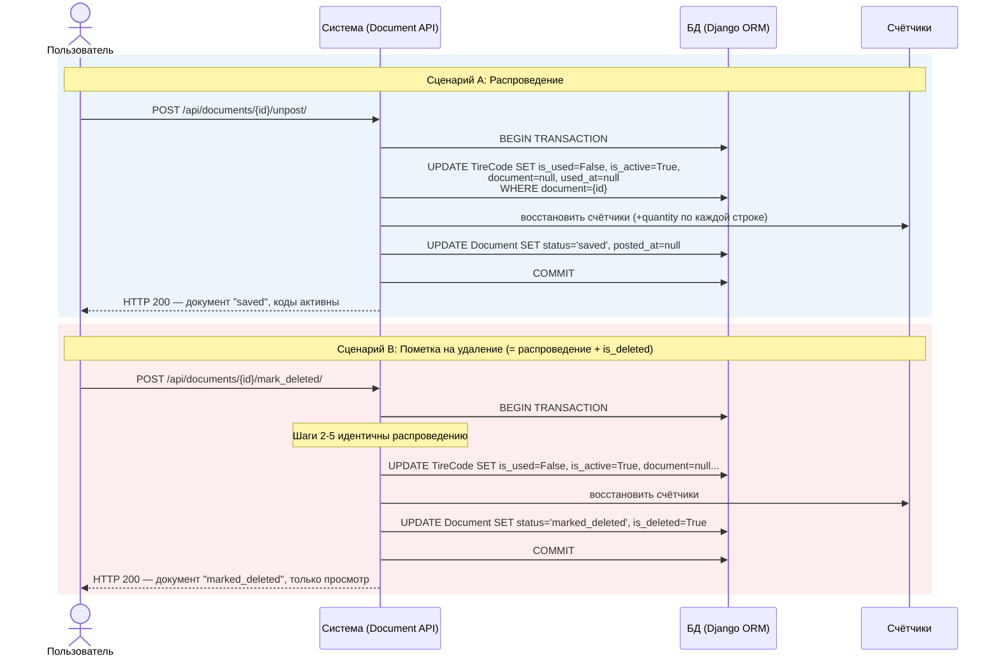
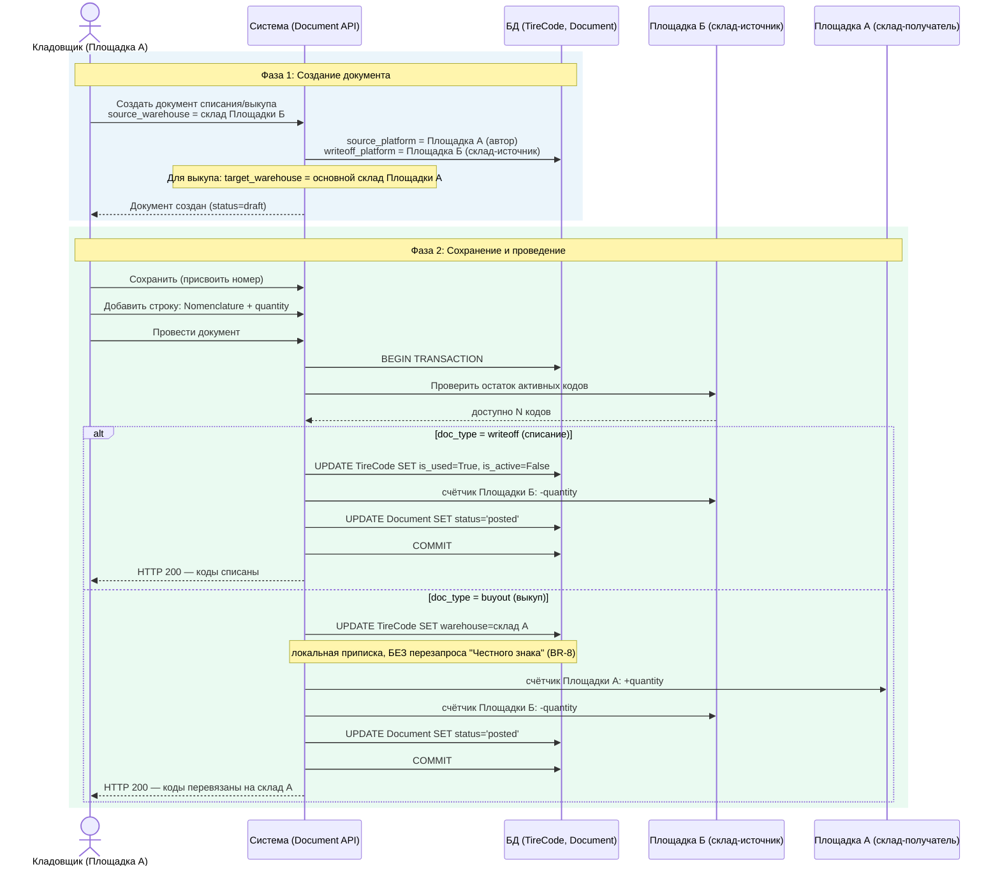

# ДИАГРАММЫ ПОСЛЕДОВАТЕЛЬНОСТЕЙ
# Проект «Обработка QR-кодов» — v1.0
# Сгенерировано: 2026-09-20

---

## Обзор

Четыре ключевых сценария:

| № | Сценарий | Бизнес-правила | Визуализация |
|---|----------|----------------|--------------|
| 1 | Загрузка файла с DataMatrix-кодами | BR-1, BR-2, BR-3, BR-14 | PNG |
| 2 | Проведение документа (атомарная транзакция) | BR-6, BR-7 | PNG |
| 3 | Распроведение / Пометка на удаление | BR-9, BR-10 | PNG |
| 4 | Списание с чужой площадки / Выкуп | BR-8, BR-13 | PNG |

---

## Диаграмма 1. Загрузка файла с DataMatrix-кодами

### Участники
- **Пользователь** (Кладовщик) — инициирует загрузку, выбирает склад
- **Система** (Upload API) — оркестрирует процесс загрузки
- **nechestniy_znak** — внешняя библиотека для запроса данных по коду
- **Парсер атрибутов** — извлекает brand, model, size из ответа
- **БД** (Django ORM) — хранилище TireCode, TireNomenclature, логов

### Текстовое описание (Mermaid)

### Ключевые моменты
1. **Дедупликация (BR-3):** проверка по `qr_code` с unique-ограничением; повторный запрос в «Честный знак» не отправляется
2. **Авто-создание номенклатуры (BR-1):** при первом сочетании `brand + model + size`; неполные атрибуты → пропуск
3. **product_name (BR-14):** заполняется из ответа Честного знака при создании; fallback `brand + model + size`; не перезаписывается при повторной загрузке
4. **Процесс не прерывается** на ошибках — каждый код обрабатывается независимо

---

## Диаграмма 2. Проведение документа (атомарная транзакция)

### Участники
- **Пользователь** (Кладовщик) — инициирует проведение
- **Система** (Document API) — оркестрирует транзакцию
- **БД** (Django ORM) — TireCode, Document, счётчики
- **FIFO Selector** — выбор старейших кодов
- **Счётчики** — активные коды по позициям и складам

### Текстовое описание (Mermaid)

### Ключевые моменты
1. **Атомарность (BR-6):** вся транзакция — единое целое. Либо все строки обработаны, либо ни одна
2. **FIFO (BR-7):** сортировка по `created_at` (дата загрузки), внутри дня — по `id` (автоинкремент, меньший ID = раньше)
3. **Без резерва (BR-6):** коды не блокируются заранее; конфликт обнаруживается при проведении; кто первым провёл — забрал коды
4. **При нехватке:** документ остаётся в `saved`, пользователь корректирует количество и повторяет

---

## Диаграмма 3. Распроведение / Пометка на удаление

### Участники
- **Пользователь** — инициирует операцию
- **Система** (Document API) — выполняет откат
- **БД** — TireCode, Document
- **Счётчики** — восстановление значений

### Текстовое описание (Mermaid)

### Ключевые моменты
1. **Редактирование проведённого (BR-9):** запрещено. Для изменений — распроведение в `saved`
2. **Помечен на удаление (BR-10):** это **распроведение + `is_deleted=true`** — комбинированная операция
3. **Откат:** коды возвращаются в активные (`is_active=True, is_used=False`), `document=null`, `used_at=null`
4. **Счётчики** восстанавливаются на `quantity` по каждой строке документа
5. **Статус `marked_deleted`:** только просмотр, любые изменения запрещены

---

## Диаграмма 4. Списание с чужой площадки / Выкуп

### Участники
- **Кладовщик** (Площадка А) — создаёт документ
- **Система** (Document API) — оркестрация
- **БД** — TireCode, Document, склады
- **Площадка Б** (склад-источник) — откуда списываются коды
- **Площадка А** (склад-получатель) — только для выкупа

### Текстовое описание (Mermaid)

### Ключевые моменты
1. **Списание с чужой площадки (BR-13):** разрешено; документ на имя создавшего кладовщика; счётчик уменьшается у площадки-источника списания
2. **Поля документа:** `source_platform` = площадка автора (А), `writeoff_platform` = площадка склада-источника (Б) — они различаются
3. **Выкуп (BR-8):** приписка меняется локально (`warehouse` обновляется), без перезапроса «Честного знака»
4. **При выкупе** `target_warehouse` = основной склад площадки автора; коды остаются активными, но на новом складе
5. **При списании** `target_warehouse` = null; коды помечаются `is_used=True, is_active=False`

---

## Приложение: матрица сценариев и тест-кейсов

| Сценарий | Тест-кейсы |
|----------|-----------|
| Загрузка QR-кодов | TC-LOAD-001 … TC-LOAD-013 |
| Проведение документа | TC-POST-001 … TC-POST-008, TC-CONC-001, TC-CONC-002 |
| Распроведение / удаление | TC-UNPOST-001 … TC-UNPOST-004 |
| Списание с чужой площадки | TC-POST-006, TC-AUTH-004, TC-AUTH-007 |
