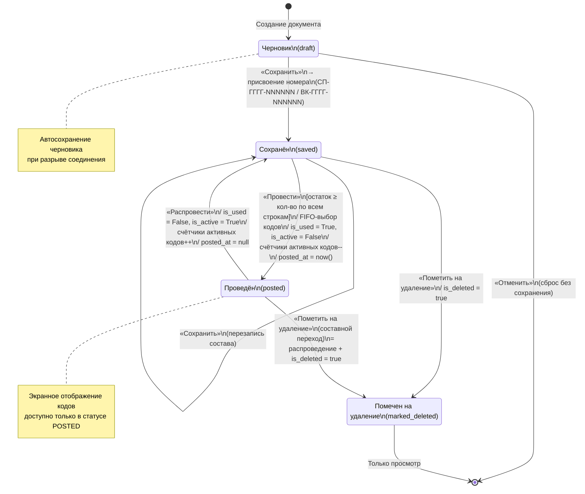

# Диаграмма состояний документа (State Machine)

**Проект:** Обработка QR-кодов  
**Версия:** 1.0  
**Дата:** 20 сентября 2026  
**Источник:** Артефакты проекта v3, Раздел 3 — Статусная модель документа

---

## 1. Обзор

Документ (списание или выкуп) проходит через четыре состояния в течение своего жизненного цикла. Переходы между состояниями управляются действиями пользователя и атомарными транзакциями с базой данных.

### Состояния

| Состояние | Код | Описание | Кнопки доступны |
|----------|-----|----------|----------------|
| Черновик | `draft` | Документ создан, но не сохранён. Номер ещё не присвоен. Автосохранение при разрыве соединения. | «Добавить строку», «Сохранить», «Отменить» |
| Сохранён | `saved` | Документ сохранён, номер присвоен. Можно редактировать состав. | «Добавить строку», «Сохранить», «Провести», «Пометить на удаление» |
| Проведён | `posted` | Документ проведён. Коды закреплены (FIFO), счётчики уменьшены. Редактирование запрещено. | «Распровести», «Экранное отображение кодов» |
| Помечен на удаление | `marked_deleted` | Документ помечен как удалённый (`is_deleted = true`). Если был проведён — коды возвращены. | Только просмотр |

### Диаграмма

---

## 2. Mermaid (State Diagram)

---

## 3. Матрица переходов

| Из → | draft | saved | posted | marked_deleted |
|------|-------|-------|--------|----------------|
| **draft** | — | «Сохранить» (номер) | — | — |
| **saved** | — | «Сохранить» (перезапись) | «Провести» (FIFO, атомарно) | «Пометить на удаление» |
| **posted** | — | «Распровести» (откат кодов) | — | «Пометить на удаление» (составной) |
| **marked_deleted** | — | — | — | — (только просмотр) |

**Невозможные переходы:** draft → posted, draft → marked_deleted, posted → draft, marked_deleted → любое.

---

## 4. Детализация переходов

### 4.1. draft → saved («Сохранить»)

| Атрибут | Значение |
|---------|----------|
| **Триггер** | Нажатие кнопки «Сохранить» |
| **Охранное условие** | В документе есть хотя бы одна строка (`DocumentItem`) |
| **Действия** | 1. Присвоение номера по формату `СП-ГГГГ-NNNNNN` (списание) или `ВК-ГГГГ-NNNNNN` (выкуп). Сквозная нумерация в пределах типа и года, сброс счётчика 1 января. 2. `status = 'saved'` 3. Запись в БД |
| **При ошибке** | Документ остаётся в `draft` |

### 4.2. draft → (отмена) («Отменить»)

| Атрибут | Значение |
|---------|----------|
| **Триггер** | Нажатие кнопки «Отменить» |
| **Охранное условие** | Нет |
| **Действия** | Сброс содержимого документа без сохранения. Закрытие формы. Данные не записываются в БД. |
| **Особое** | При разрыве соединения — автосохранение черновика (восстановление при следующем входе) |

### 4.3. saved → saved («Сохранить», перезапись)

| Атрибут | Значение |
|---------|----------|
| **Триггер** | Нажатие кнопки «Сохранить» в статусе `saved` |
| **Охранное условие** | Нет |
| **Действия** | Перезапись состава строк (`DocumentItem`). Номер не меняется. `updated_at = now()`. |
| **При ошибке** | Состав остаётся прежним |

### 4.4. saved → posted («Провести»)

| Атрибут | Значение |
|---------|----------|
| **Триггер** | Нажатие кнопки «Провести» |
| **Охранное условие** | Для каждой строки: `quantity` ≤ количество активных кодов по номенклатуре на складе-источнике |
| **Действия (атомарная транзакция)** | 1. Проверка остатка по всем строкам. 2. При нехватке хотя бы по одной строке — **ROLLBACK**, ошибка с указанием позиции и доступного количества. Документ остаётся в `saved`. 3. При достаточности — FIFO-выбор: старейшие активные коды по `created_at`, внутри дня по `id`. 4. `TireCode.is_used = True`, `TireCode.is_active = False`, `TireCode.document = <документ>`, `TireCode.used_at = now()`. 5. Уменьшение счётчиков активных кодов по позициям и складам. 6. `Document.status = 'posted'`, `Document.posted_at = now()`. |
| **Конкурентность** | Без резерва. Кто первым провёл — забрал коды. Конфликт обнаруживается транзакцией. |

### 4.5. posted → saved («Распровести»)

| Атрибут | Значение |
|---------|----------|
| **Триггер** | Нажатие кнопки «Распровести» |
| **Охранное условие** | Документ в статусе `posted` |
| **Действия** | 1. Для всех кодов, привязанных к документу: `is_used = False`, `is_active = True`, `document = null`, `used_at = null`. 2. Восстановление счётчиков активных кодов по позициям и складам. 3. `Document.status = 'saved'`, `Document.posted_at = null`. |
| **Результат** | Документ доступен для редактирования и повторного проведения |

### 4.6. saved → marked_deleted («Пометить на удаление»)

| Атрибут | Значение |
|---------|----------|
| **Триггер** | Нажатие кнопки «Пометить на удаление» в статусе `saved` |
| **Охранное условие** | Документ в статусе `saved` (не проведён — откатывать нечего) |
| **Действия** | `Document.is_deleted = true`, `Document.status = 'marked_deleted'`. |
| **Результат** | Документ доступен только для просмотра |

### 4.7. posted → marked_deleted («Пометить на удаление», составной переход)

| Атрибут | Значение |
|---------|----------|
| **Триггер** | Нажатие кнопки «Пометить на удаление» в статусе `posted` |
| **Охранное условие** | Документ в статусе `posted` |
| **Действия (составные)** | 1. Распроведение (см. 4.5): возврат кодов, восстановление счётчиков. 2. `Document.is_deleted = true`, `Document.status = 'marked_deleted'`. |
| **Результат** | Коды возвращены в активные. Документ помечен как удалённый. |

---

## 5. Действия по состояниям (entry / exit / do)

| Состояние | Entry-действие | Do-действие | Exit-действие |
|-----------|---------------|-------------|--------------|
| **draft** | Создание пустого документа. Заполнение `author`, `source_platform`, `doc_type` | Автосохранение при разрыве соединения. Добавление/удаление строк. | — |
| **saved** | Присвоение номера (при первом переходе из draft) | Редактирование состава строк. Дубликат номенклатуры → подсветка + `quantity += 1` | — |
| **posted** | FIFO-выбор кодов, пометка использованными, уменьшение счётчиков | Только просмотр. Экранное отображение кодов. | Возврат кодов, восстановление счётчиков (при распроведении) |
| **marked_deleted** | `is_deleted = true`. Если переход из posted — сначала распроведение | Только просмотр | — |

---

## 6. Влияние на связанные сущности

### 6.1. TireCode

| Переход | is_active | is_used | document | used_at |
|---------|-----------|---------|----------|---------|
| saved → posted | `False` | `True` | `<документ>` | `now()` |
| posted → saved (распроведение) | `True` | `False` | `null` | `null` |
| posted → marked_deleted | `True` | `False` | `null` | `null` |

### 6.2. Счётчики активных кодов

| Переход | Действие |
|---------|----------|
| saved → posted | Уменьшение по каждой номенклатуре на складе-источнике |
| posted → saved | Восстановление (увеличение) |
| posted → marked_deleted | Восстановление (как при распроведении) |

### 6.3. Document

| Переход | status | is_deleted | posted_at |
|---------|--------|------------|-----------|
| draft → saved | `saved` | `false` | `null` |
| saved → posted | `posted` | `false` | `now()` |
| posted → saved | `saved` | `false` | `null` |
| saved → marked_deleted | `marked_deleted` | `true` | `null` |
| posted → marked_deleted | `marked_deleted` | `true` | `null` |

---

## 7. Права доступа по состояниям

| Действие | Manager (своя площадка) | Manager (чужая) | Storekeeper (свой документ) | Storekeeper (чужой документ) |
|----------|------------------------|-----------------|---------------------------|------------------------------|
| Создать (→ draft) | ✅ | ❌ | ✅ | ❌ |
| Сохранить (→ saved) | ✅ | ❌ (только чтение) | ✅ | ❌ (не видит) |
| Провести (→ posted) | ✅ | ❌ | ✅ | ❌ |
| Распровести | ✅ | ❌ | ✅ | ❌ |
| Пометить на удаление | ✅ | ❌ | ✅ | ❌ |
| Экранное отображение | ✅ | ✅ (чтение) | ✅ | ❌ |
| Просмотр marked_deleted | ✅ | ✅ (чтение) | ✅ | ❌ |

---

## 8. Особые случаи

### 8.1. Автосохранение черновика

При разрыве соединения в статусе `draft` система автоматически сохраняет текущее состояние черновика (состав строк, выбранный склад). При следующем входе пользователя — восстановление с предложением продолжить редактирование.

### 8.2. Конкурентное проведение

Два пользователя одновременно проводят документы, ссылающиеся на одни и те же активные коды. Атомарная транзакция гарантирует: кто первым завершил `COMMIT` — забрал коды. Второй получает ошибку нехватки остатка, документ остаётся в `saved`.

### 8.3. Списание с чужой площадки

Кладовщик может создавать документ списания с любой площадки (не только своей). При этом:
- `source_platform` = площадка автора документа
- `writeoff_platform` = площадка склада-источника списания (может отличаться)
- Счётчики уменьшаются у площадки-источника списания

### 8.4. Выкуп

Документ выкупа (`doc_type = 'buyout'`) проходит те же состояния. Отличие — при проведении коды не просто списываются, а перевязываются на склад автора (`target_warehouse`). Перезапрос «Честного знака» не выполняется (бизнес-правило 8).

---

## 9. Бизнес-правила, связанные с состояниями

| Правило | Связь со state machine |
|---------|------------------------|
| BP-5: Экранное отображение | Доступно только в `posted` |
| BP-6: Параллельная работа | Конфликт обнаруживается при переходе `saved → posted` (атомарная транзакция) |
| BP-7: FIFO | Выбор кодов при переходе `saved → posted` |
| BP-9: Редактирование проведённого | Запрещено в `posted`. Для изменений — `posted → saved` (распроведение) |
| BP-10: Помечен на удаление | `= распроведение + is_deleted = true`. Переход в `marked_deleted` |
| BP-16: Нумерация | Номер присваивается при переходе `draft → saved` |
